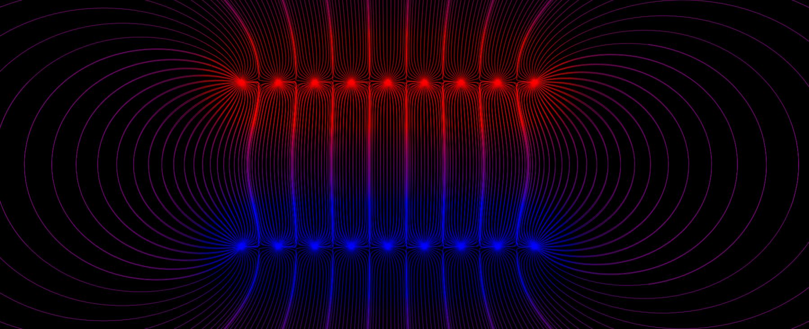
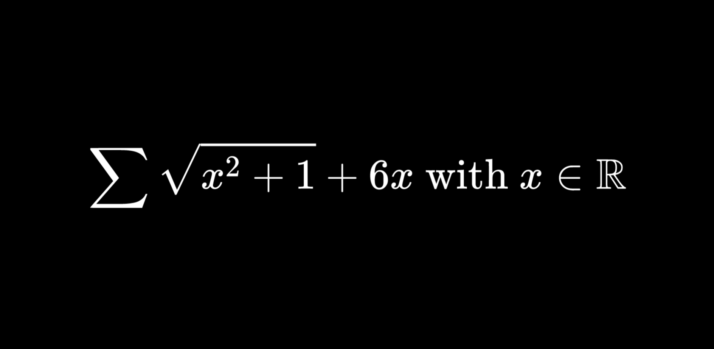

# Physics Simulation Engine


<br/>

## Presentation
Physics Simulation Engine (or pSEngine) is a JavaScript library that allows you to build simulations and animate them. You can use it freely by building science popularization content, by creating WEB animations, or just by simulating physical and mathematical phenomena on your own.

The main goal of this library is to allow you to only focus on building the simulation or the animation, without worrying about the technical program requirements (like handling an update loop, directly drawing shapes in color, or writing LaTeX code directly into the canvas, ...). pSEngine uses `canvas` HTML components, using the [p5.js](https://p5js.org/) library to draw shapes and handle colors, and the [MathJax 3.0](https://www.mathjax.org/) library to handle LaTeX code.

pSEngine is a free and open-source project, so you can directly support it by submitting improvements and by creating new pull requests or issues. We'll be happy to answer your questions and to add your new code implementation ideas.

<br/>

## Get Started
To get started using pSEngine, you should check the [Physics Simulation Engine wiki](https://github.com/mecanicascience/PhysicsSimulationEngine/wiki), which also contains detailed information about nearly everything possible with this JavaScript library. If you just want to use a default template, you can found the [main template code here](https://github.com/mecanicascience/PhysicsSimulationEngine/tree/master/examples/template).

If you want to know how simulations (and thus the engine) work, you can also [read an article](https://mecanicascience.herokuapp.com/article/les_bases_de_la_simulation&articleview&3) published on the website of Mecanica Science called 'Simulation bases' (warning : the article is written in French).

You can also check [pSEngine examples](https://github.com/mecanicascience/PhysicsSimulationEngine/tree/master/examples) to see how a simple program works. Finally, you can see full [simulation examples](https://github.com/mecanicascience/PhysicsSimulationEngine#simulations-and-animations-examples) to improve your understanding of the library.

<br/>

## Issues
If you encountered any issue, you can describe it under the [issues panel](https://github.com/mecanicascience/PhysicsSimulationEngine/issues). You can also request new features there.

Please be polite, correct and precisely describe what your problem or suggestion is. Please also note that pSEngine is only maintained by volunteers, so please be tolerant about the possible answer delay.

<br/>

## How to contribute
The list of every contribuators can be found [in this file](https://github.com/mecanicascience/PhysicsSimulationEngine/blob/master/.all-contributorsrc).

If you want to help building pSEngine, you can add new issues and post your suggestions here. To run pSEngine on your local device, you'll first need to install [Git](https://git-scm.com/) and [NodeJs](https://nodejs.org/en/).

Then, fork the project into your own GitHub account, clone the repository using `git clone https://github.com/mecanicascience/PhysicsSimulationEngine.git`, and open a terminal window inside the `PhysicsSimulationEngine` cloned folder. Once done, run `npm install` and wait for the installation to finish.

You then have two commands that you can run inside the folder `PhysicsSimulationEngine` :
 - `npm run watch` : creates a local server accessible on `localhost:8080`, which automatically restarts and compiles when modifications on the engine are made. The runned files are located into the `dev/` folder.
 - `npm run build` : compiles the new pSEngine code inside the `build/` folder.

Once your are done modifying the engine, to commit your changes to GitHub, run:
```
  git add *
  git commit -m "YOUR COMMIT MESSAGE"
  git push
```

Once everything is ready, you should be able to submit your changes as a pull request (see the [Github help documentation](https://help.github.com/en/github/collaborating-with-issues-and-pull-requests/creating-a-pull-request) about this for more information).

<br/>

## Credits
pSEngine was created and is currently maintained by [Mecanica Science](https://mecanicascience.herokuapp.com/) with the help of [Epsylene](https://github.com/Epsylene).
You can find further information and library credits down below.
 - If you want to use pSEngine, you need to follow the [license requirements](https://github.com/mecanicascience/PhysicsSimulationEngine/blob/master/LICENSE) (to sum up, you can use pSEngine everywhere and for any purpose, as long as there is a copyright notice).
 - You can find all pSEngine versions on [this link](https://github.com/mecanicascience/PhysicsSimulationEngine/releases).
 - You can check the [wiki](https://github.com/mecanicascience/PhysicsSimulationEngine/wiki) to learn how to use the library, or to find any technical information you might need.
 - pSEngine uses [p5.js](https://p5js.org/) and [MathJax 3.0](https://www.mathjax.org/).


<br/><br/>
# Simulations and animations examples
An example of an Electric field. [See live demo](https://mecanicascience.herokuapp.com/simulationview/champ_electrique&simulationview&electromag&2).


<br/>

You can also draw and animate TeX code.


<br/>

A simulation of the Solar System with real distances. [See live demo](https://mecanicascience.github.io/PhysicsSimulationEngine/examples/solar_system/).


